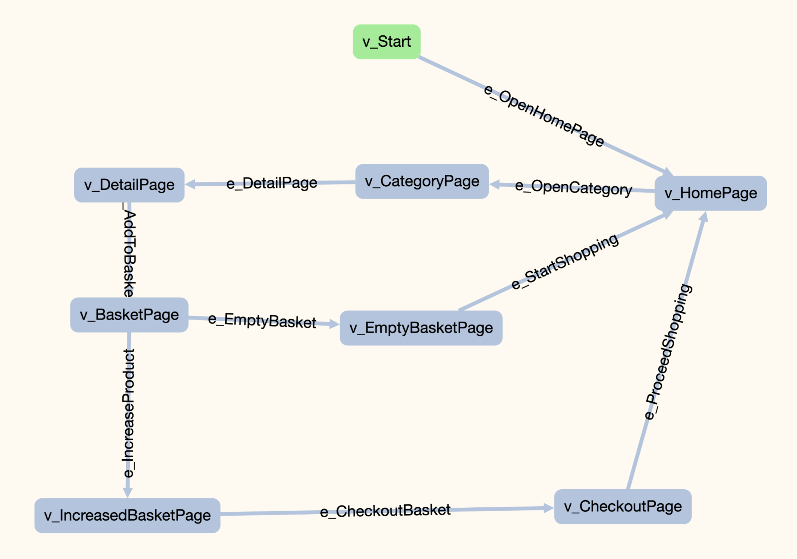

# Selenium-Graphwalker Model Based Testing
This project was created for model-based testing using Selenium and Graphwalker libraries. 4 models were used in the project. The test cases were created by targeting the <b>lcwaikiki.com</b> e-commerce website.

## Model 1

The steps in Model1 are listed as follows.
- Homepage is loaded.
- Click the "Login" button to log in.
- Incorrect Member information is sent.
- Error message expected
- If an error message appears, the page is refreshed.
- Correct information is sent.
- After logging in, the authorized homepage is displayed.
- Logout button is pressed.
- The homepage is reloaded.

## Model2 

The steps in Model2 are listed as follows.
- Homepage is loaded.
- Click a photo on the banner.
- The product listing page is displayed.
- Clicking on the logo will return to the homepage or search is performed
- The search page is displayed.
- Click on show more products button.
- Clicking on the logo will return to the main page.

## Model3 

The steps in Model3 are listed as follows.
- Homepage is loaded.
- Select a category from the category list.
- A product is selected in the drop-down list.
- The product is added to the cart on the product detail page.
- The cart page is displayed.
- The number of pieces of the product is increased.
- Click the Checkout button.
- The basket is emptied.
- Return to the homepage with the start shopping button.

## Model4

The steps in Model4 are listed as follows.
- Homepage is loaded.
- Click a photo on the banner.
- The product listing page is displayed.
- The product is added to the favorites with the favorites button on the product detail page.
- Favorites are cleared.
- The blank favorite page is displayed.
- Return to the homepage with the start shopping button.